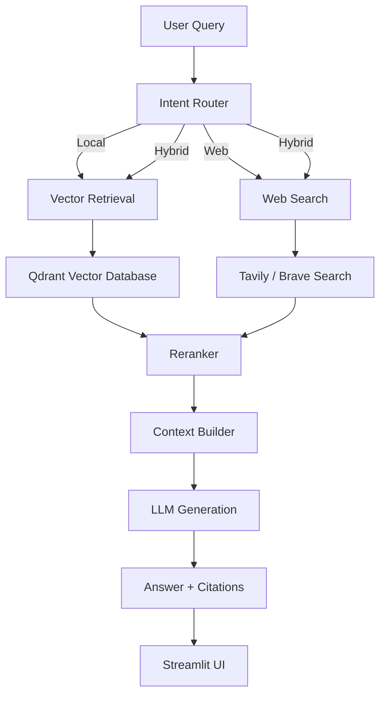

# Agentic-RAG Researcher

## Hybrid Context Question Answering System with Web Search and Citation-Aware Generation

A production-oriented Agentic RAG pipeline designed for researchers and engineers to query academic literature using a combination of:

- Local research paper retrieval
- Real-time web search
- Intelligent query routing
- Reranking
- Citation-grounded generation
- Automated evaluation

The system dynamically decides whether a query should be answered using:

- Internal research documents
- External web knowledge
- A hybrid combination of both


---

# Architecture Overview



---

# Key Features

## Intelligent Query Routing

The system uses an LLM-based router to classify queries:

```
Question
   |
   ▼
Router

   |
   ├── local
   |
   ├── web
   |
   └── hybrid
```

Examples:

| Query | Route |
|-|-|
| Explain transformer architecture from papers | Local |
| Latest AI announcements | Web |
| Compare research papers with current industry trends | Hybrid |


---

# Document Intelligence Pipeline

Research papers are processed through:

```
PDF

 |
 ▼

Layout-aware Parser

 |
 ▼

Hierarchical Chunking

 |
 ▼

Metadata Extraction

 |
 ▼

Embedding Generation

 |
 ▼

Qdrant Index
```

The ingestion pipeline preserves:

- Paper title
- Authors
- Page numbers
- DOI information
- Source metadata


---

# Retrieval Architecture

The retrieval pipeline contains:

## Semantic Retrieval

Vector similarity search using:

- Qdrant
- Dense embeddings


## Reranking

Retrieved documents are refined using:

- Cross encoder reranking
- Relevance filtering


Pipeline:

```
Query

 |
 ▼

Vector Search

 |
 ▼

Top-K Documents

 |
 ▼

Reranker

 |
 ▼

LLM Context
```


---

# Agent Workflow

The system is orchestrated using LangGraph.

Graph:

```
                 Query

                   |

                   ▼

             Intent Router

          /       |       \

         /        |        \

      Local      Web     Hybrid

        |          |        |

        ▼          ▼        ▼

     Qdrant     Search   Combined

          \       |       /

              Generation

                  |

                  ▼

          Citation Answer
```


---

# Tech Stack

## Backend

- Python
- FastAPI
- LangGraph
- Async architecture


## LLM

- OpenAI API
- Embedding models


## Vector Database

- Qdrant


## Retrieval

- Semantic search
- Hybrid retrieval
- Cross encoder reranking


## Web Search

- Tavily API
- Brave Search API


## Frontend

- Streamlit


## Evaluation

- Ragas


## Infrastructure

- Docker
- Docker Compose
- GitHub Actions


---

# Project Structure

```
agentic-rag-researcher/

├── src/

│   ├── api/

│   ├── graph/

│   ├── ingestion/

│   ├── retrieval/

│   ├── search/

│   ├── llm/

│   ├── evaluation/

│   └── utils/


├── scripts/

├── tests/

├── streamlit/

├── docker/

├── data/

├── docker-compose.yml

├── pyproject.toml

└── README.md
```

---

# Running Locally

## 1. Clone Repository

```bash
git clone https://github.com/<username>/agentic-rag-researcher.git

cd agentic-rag-researcher
```


---

## 2. Create Environment

```bash
python -m venv .venv

source .venv/bin/activate
```

Windows:

```bash
.venv\Scripts\activate
```


---

## 3. Install Dependencies

```bash
pip install -e .
```


---

## 4. Configure Environment Variables

Create:

```
.env
```

Example:

```env
OPENAI_API_KEY=

QDRANT_URL=http://localhost:6333

TAVILY_API_KEY=

BRAVE_API_KEY=
```


---

# Start Infrastructure

Run:

```bash
docker compose up
```


Services:

```
FastAPI
    |
    localhost:8000


Qdrant
    |
    localhost:6333


Streamlit
    |
    localhost:8501
```

---

# Ingest Research Papers

Place PDFs:

```
data/papers/
```

Run:

```bash
python scripts/ingest_papers.py
```


---

# Start Application

Backend:

```bash
uvicorn src.main:app --reload
```


Frontend:

```bash
streamlit run streamlit/app.py
```


---

# API Usage

Endpoint:

```
POST /api/v1/query
```

Request:

```json
{
    "query":
    "Explain retrieval augmented generation"
}
```


Response:

```json
{
    "query":
    "Explain retrieval augmented generation",

    "route_taken":
    "local",

    "answer":
    "RAG combines retrieval systems with language models..."
}
```

---

# Evaluation

The project includes automated RAG evaluation.

Metrics:

## Faithfulness

Measures whether answers are supported by retrieved evidence.


## Answer Relevance

Measures whether the response answers the user's question.


## Context Precision

Measures retrieval quality.


Run:

```bash
python scripts/evaluate_rag.py
```

---

# Engineering Highlights

This project demonstrates:

✅ Agentic workflow orchestration  
✅ Stateful graph execution  
✅ Hybrid retrieval architecture  
✅ Vector database management  
✅ Async API design  
✅ Citation-aware generation  
✅ RAG evaluation pipeline  
✅ Production-style repository organization  


---

# Future Improvements

Planned:

- Streaming token responses
- Authentication layer
- Distributed vector indexing
- Better document parsing with LlamaParse
- Human feedback loop
- Retrieval analytics dashboard


---

# License

MIT License
